<div align="center">


# JuZhou 1.0

### The First Edge-Native Text-to-Image Foundation Model Trained Entirely on China-Developed AI Accelerators

---

[](https://hswai2026.github.io/JuZhouV1/)
[](https://sc-web.huishiwei.cn/#/scenarioDetail/48)
[](https://www.pgyer.com/mojiemobilellm-android)
[](https://www.icswb.com/default.php?mod=live_text&live_id=914&temp=live_video)
[](https://github.com/Codecode-X/Juzhou/tree/main/JuZhou_Technical_Report)

**JuZhou Team, HSW Group**

</div>

---

## 📋 Overview

JuZhou 1.0 is an **ultra-lightweight** text-to-image (T2I) foundation model designed for **fully offline, on-device execution**. It features:

- 🔹 A compact **0.387B** image-generation backbone (0.385B U-Net + 1.90M VAE decoder)
- 🔹 **4-step** distilled inference via Rectified Flow + DMD2, enabling image generation within seconds on mobile
- 🔹 **Native Chinese** semantic alignment trained on 9M curated Chinese image-text pairs — no external translation needed
- 🔹 **Entirely trained on domestic hardware** — Sugon K100 AI accelerators, without relying on NVIDIA GPUs

Despite its compact scale, JuZhou 1.0 achieves an overall **GenEval score of 0.69**, outperforming published baselines including **SDXL** (2.6B, 0.55), **SD3-Medium** (2B, 0.62), and **IF-XL** (4.3B, 0.61).

<p align="center">
  
  <br>
  <em>Overview of JuZhou 1.0: An edge-native text-to-image foundation model featuring an ultra-light on-device architecture, native Chinese semantic alignment, and fully offline mobile deployment. The entire training pipeline is completed exclusively on domestic compute (Sugon K100).</em>
</p>

<p align="center">
  
  
  
  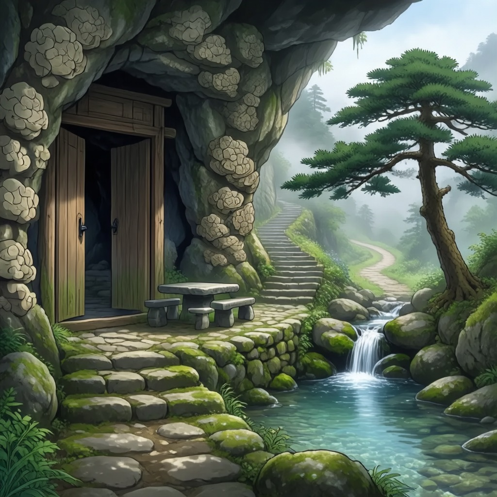
  <br>
  
  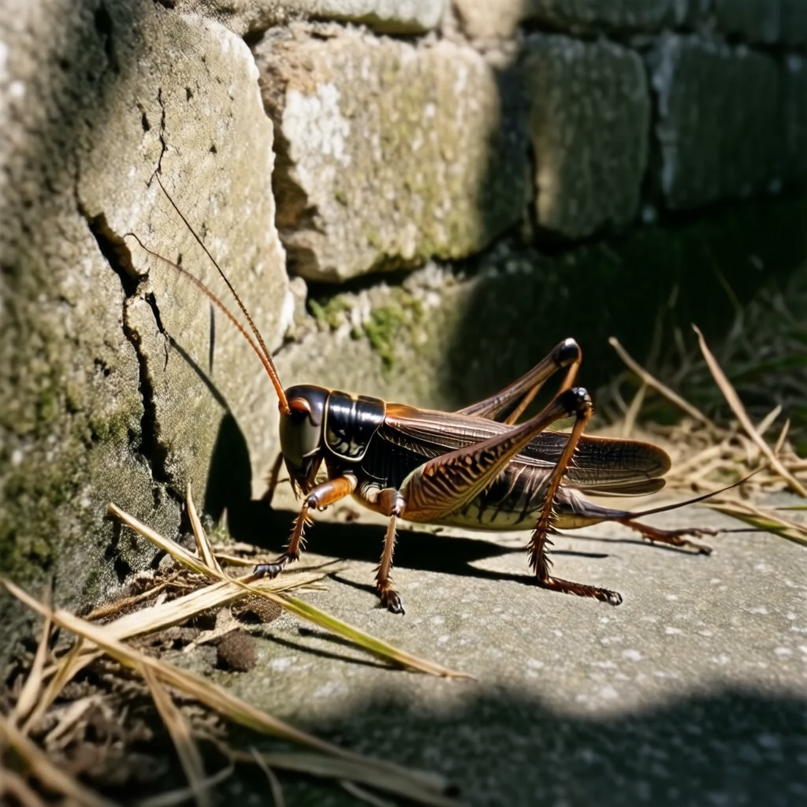
  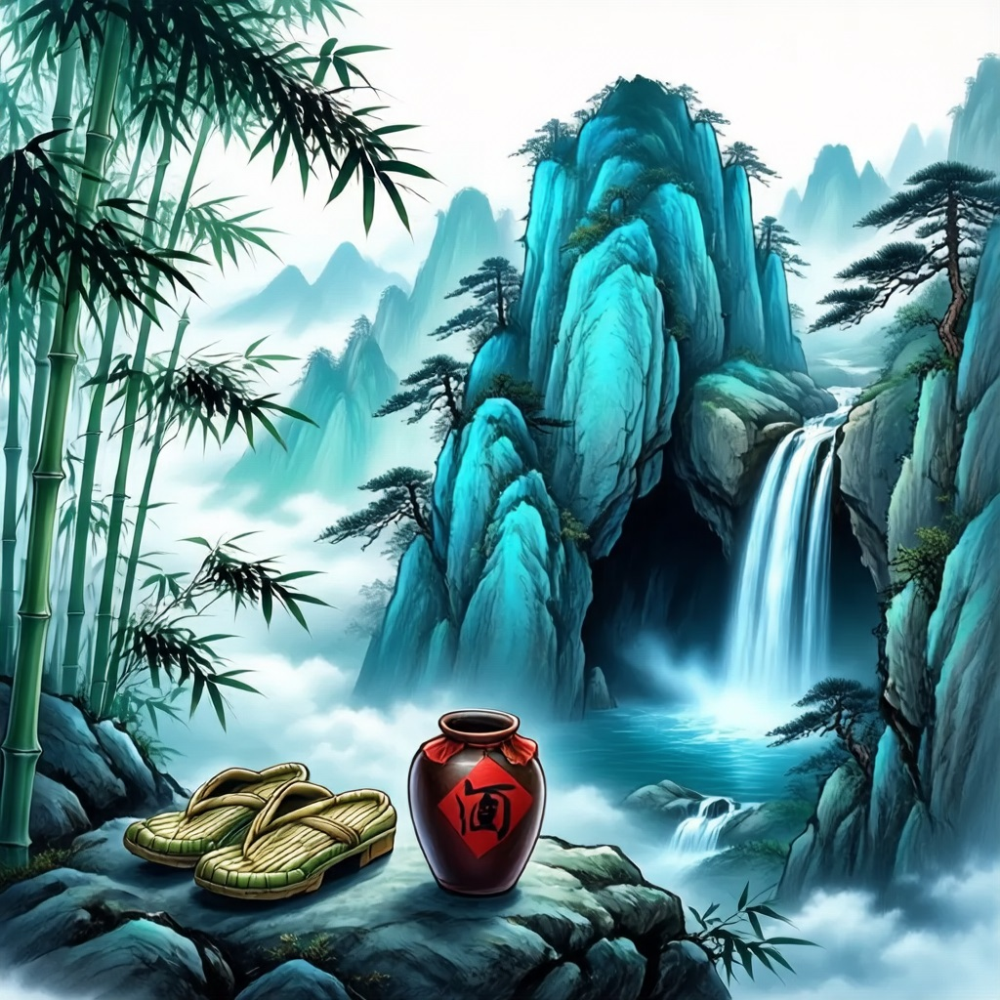
  
  <br>
  <em>High-fidelity images generated by JuZhou 1.0 entirely on-device.</em>
</p>

---

## ✨ Key Contributions

1. **Ultra-Lightweight, Native Chinese T2I Model for Offline Mobile Deployment**
   The first native Chinese T2I foundation model purpose-built for on-device offline execution, with a 0.387B-parameter image-generation backbone enabling privacy-preserving local inference.

2. **Scalable Chinese Data Construction Pipeline**
   A 9M general Chinese image-text corpus built from filtered DiffusionDB prompts, SD3.5-Large synthetic images, and Qwen3-based prompt translation, plus a 1.77M poem-grounded corpus for classical Chinese poetry-to-image generation.

3. **Domestic Computing Infrastructure Validation**
   The full training and distillation pipeline is completed on **Sugon K100** clusters (224 DCUs), validating the feasibility of domestic hardware for large-scale generative AI training.

4. **Heterogeneous Mobile Deployment**
   Full-stack adaptation for both **Android** (MNN + QNN) and **iOS** (Core ML), enabling standardized edge AI deployment across major mobile platforms.

5. **Native Chinese Application**
   A publicly released 4-step classical Chinese poetry-to-image app (**Mojie 墨界**) demonstrating JuZhou 1.0's ability to capture nuanced cultural contexts without external translation modules.

---

## 🏗️ Architecture

<p align="center">
  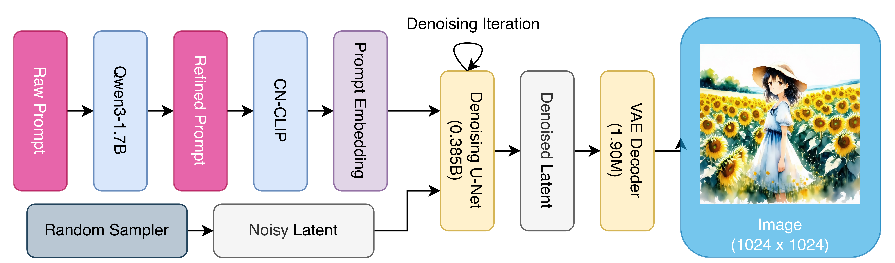
  <br>
  <em>Overview of the JuZhou 1.0 framework: A raw poem or user prompt is refined by Qwen3-1.7B and then encoded by CN-CLIP to obtain Chinese semantic conditioning. The conditioning signal is injected into a 0.385B-parameter denoising U-Net for efficient high-resolution generation. The generated latent representation is decoded by an ultra-compact 1.9M-parameter VAE decoder without attention layers. DMD2 distillation further shortens the sampling trajectory from 28 steps to 4 steps.</em>
</p>

### Ultra-Lightweight Design

| Model | Denoiser + VAE | Denoiser | VAE Decoder | Mobile |
|:---|:---:|:---:|:---:|:---:|
| SD v1.5 | ~0.91B | ~0.86B | ~49.49M | ✗ |
| SD v2.1 | ~0.92B | ~0.87B | ~49.49M | ✗ |
| SDXL 1.0 | ~2.62B | ~2.57B | ~49.49M | ✗ |
| SD 3.5 Large | ~8.11B | ~8.06B | ~49.55M | ✗ |
| MobileDiffusion | ~0.396B | ~0.386B | ~9.8M | ✓ |
| SnapGen | ~0.373B | ~0.372B | ~1.38M | ✓ |
| **JuZhou 1.0 (Ours)** | **~0.387B** | **~0.385B** | **~1.90M** | **✓** |

### Denoising Network

<p align="center">
  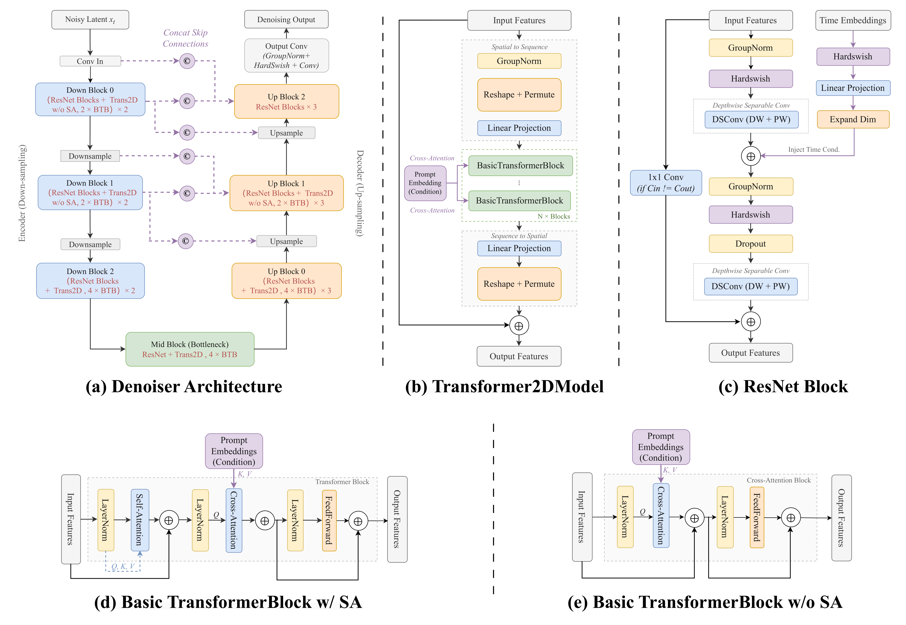
  <br>
  <em>Overview of the lightweight denoising network. (a) Denoiser architecture. (b) Transformer2DModel. (c) ResNet Block. (d) BasicTransformerBlock w/ SA. (e) BasicTransformerBlock w/o SA. BTB denotes BasicTransformerBlock, and SA denotes self-attention.</em>
</p>

The denoising network follows an encoder–bottleneck–decoder U-Net structure with **selective self-attention allocation** and **lightweight multi-scale skip connections**. Key design choices:

- **Selective attention**: The first two down/up blocks retain only cross-attention (removing self-attention for efficiency), while the third down block and middle block employ both self-attention and cross-attention
- **Hardware-friendly activation**: GroupNorm + Hardswish stabilize training and provide hardware-friendly nonlinear transformation
- **Redesigned skip connections**: Shallow features directly connect to the highest-resolution decoder; skip connection from Down Block 2 to Up Block 0 is removed to avoid unnecessary feature transfer

### VAE Decoder

<p align="center">
  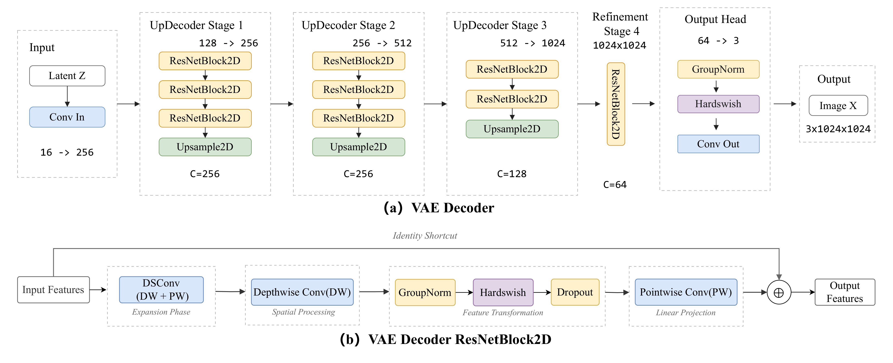
  <br>
  <em>Overview of the compact VAE decoder. (a) VAE decoder architecture. (b) VAE decoder ResNetBlock2D.</em>
</p>

A compact **attention-free** architecture using depthwise–pointwise convolution, reducing the decoder to only ~1.9M parameters:

- **Factorized convolution**: Each decoder block sequentially applies depthwise convolution → pointwise convolution → depthwise convolution → GroupNorm → Hardswish → Dropout → pointwise convolution
- **Channel-progressive decoding**: 256 → 256 → 128 → 64 channels, progressively recovering image details
- **Memory-efficient**: The attention-free decoding path reduces peak activation memory during high-resolution image reconstruction

---

## 📊 Data Curation

We construct two complementary Chinese image-text datasets: a general-purpose **9M Chinese image-text corpus** and a **1.77M poem-grounded synthetic corpus**.

### General Chinese Text-to-Image Corpus (9M pairs)

<p align="center">
  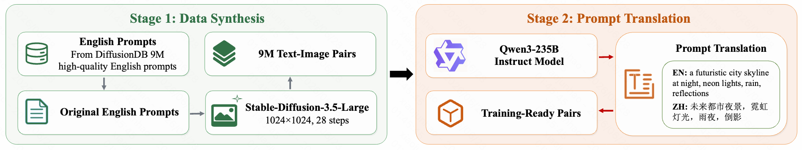
  <br>
  <em>Overview of the General Chinese Text-to-Image Curation Pipeline. Two stages construct a Chinese image-text corpus: (1) Data Synthesis starts from 9M filtered English text-to-image prompts from DiffusionDB and synthesize images via Stable Diffusion 3.5 Large; (2) Prompt Translation converts prompts into Chinese using Qwen3-235B-Instruct.</em>
</p>

- Filtered English prompts from **DiffusionDB** → images synthesized via **SD3.5-Large** → prompts translated to Chinese using **Qwen3-235B-Instruct**
- This strategy avoids translation-induced prompt drift before image synthesis, preserving the open-domain visual distribution while providing Chinese textual supervision

### Poem-Grounded Synthetic Corpus (1.77M pairs)

<p align="center">
  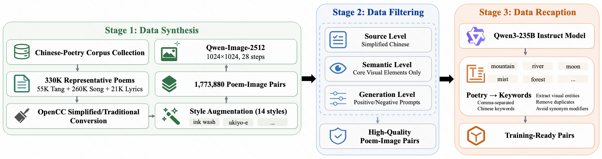
  <br>
  <em>Overview of the Classical Poetry-to-Image Curation Pipeline. Three stages transform classical Chinese poetry into 1,773,880 structured image-text pairs: (1) Data Synthesis expands ~330K poems with 14 stylistic descriptors; (2) Data Filtering applies source-level, semantic-level, and generation-level quality controls; (3) Data Recaption converts each poem into compact keyword sequences via Qwen3-235B.</em>
</p>

- ~330K classical Chinese poems from the public Chinese-Poetry repository, normalized to Simplified Chinese via OpenCC
- **14 stylistic descriptors** spanning traditional East Asian, Western art, and modern illustration styles (Pop Art, 3D Animated Film, Comic, Chinese Classical Painting, etc.)
- **Three-stage filtering**: source-level cleaning → semantic-level pruning → generation-level quality control
- **Qwen3-235B**-based recaptioning converts each poem into visually grounded keyword sequences

### Edge-Oriented Prompt Refiner

The deployed Android application must handle raw classical poems directly. We fine-tune **Qwen3-1.7B** using LoRA on raw-poem/teacher-generated-prompt pairs, where the 235B teacher model provides prompt supervision during data construction, and the LoRA-tuned 1.7B model enables practical on-device prompt refinement.

---

## 🧪 Experimental Results

### GenEval Benchmark (Quantitative)

| Method | Params↓ | Overall↑ | Mobile | Single↑ | Two↑ | Count↑ | Color↑ | Pos.↑ | Color Attr.↑ |
|:---|:---:|:---:|:---:|:---:|:---:|:---:|:---:|:---:|:---:|
| **Large-scale baselines** | | | | | | | | | |
| SD3-Medium | 2.0B | 0.62 | ✗ | 0.98 | 0.74 | 0.63 | 0.67 | **0.34** | 0.36 |
| SDXL | 2.6B | 0.55 | ✗ | 0.98 | 0.74 | 0.39 | 0.85 | 0.15 | 0.23 |
| IF-XL | 4.3B | 0.61 | ✗ | 0.97 | 0.74 | 0.66 | 0.81 | 0.13 | 0.35 |
| FLUX.1-dev | 12.0B | 0.67 | ✗ | 0.99 | 0.81 | **0.79** | 0.74 | 0.20 | 0.47 |
| FLUX.1-schnell | 12.0B | **0.71** | ✗ | 0.99 | **0.92** | 0.73 | 0.78 | 0.28 | 0.54 |
| **Compact baselines** | | | | | | | | | |
| SnapGen | 0.373B | 0.66 | ✓ | **1.00** | 0.84 | 0.60 | 0.88 | 0.18 | 0.45 |
| Sana-0.6B | 0.6B | 0.64 | ✗ | 0.99 | 0.76 | 0.64 | 0.88 | 0.18 | 0.39 |
| Hunyuan-DiT | 1.5B | 0.63 | ✗ | 0.97 | 0.77 | 0.71 | 0.88 | 0.13 | 0.30 |
| Sana-1.6B | 1.6B | 0.66 | ✗ | 0.99 | 0.77 | 0.62 | 0.88 | 0.21 | 0.47 |
| **JuZhou 1.0 (Ours)** | **0.387B** | **0.69** | **✓** | **0.99** | **0.87** | 0.61 | **0.88** | 0.24 | **0.55** |

> 🏆 JuZhou 1.0 achieves the **2nd-highest overall GenEval score** (0.69) while using **~31× fewer parameters** than FLUX.1-schnell, and is among the only two models supporting mobile deployment.

### Foundational Generation Quality (Qualitative)

<p align="center">
  <em><b>Ours (28 steps)</b> &nbsp;&nbsp;&nbsp;&nbsp;&nbsp;&nbsp;&nbsp;&nbsp;&nbsp;&nbsp;&nbsp;&nbsp;&nbsp;&nbsp;&nbsp;&nbsp;&nbsp;&nbsp;&nbsp;&nbsp;&nbsp;&nbsp;&nbsp;&nbsp;&nbsp;&nbsp;&nbsp;&nbsp; <b>SD1.5</b> &nbsp;&nbsp;&nbsp;&nbsp;&nbsp;&nbsp;&nbsp;&nbsp;&nbsp;&nbsp;&nbsp;&nbsp;&nbsp;&nbsp;&nbsp;&nbsp;&nbsp;&nbsp;&nbsp;&nbsp;&nbsp;&nbsp;&nbsp;&nbsp;&nbsp;&nbsp;&nbsp;&nbsp; <b>SD2.1</b> &nbsp;&nbsp;&nbsp;&nbsp;&nbsp;&nbsp;&nbsp;&nbsp;&nbsp;&nbsp;&nbsp;&nbsp;&nbsp;&nbsp;&nbsp;&nbsp;&nbsp;&nbsp;&nbsp;&nbsp;&nbsp;&nbsp;&nbsp;&nbsp;&nbsp;&nbsp;&nbsp;&nbsp;<b>SDXL</b> &nbsp;&nbsp;&nbsp;&nbsp;&nbsp;&nbsp;&nbsp;&nbsp;&nbsp;&nbsp;&nbsp;&nbsp;&nbsp;&nbsp;&nbsp;&nbsp;&nbsp;&nbsp;&nbsp;&nbsp;&nbsp;&nbsp;&nbsp;&nbsp;&nbsp;&nbsp;&nbsp;&nbsp;<b>SD3.5-L</b></em>
  <br>
  
  
  
  
  
  <br>
  <em>Macro shot of a dew-covered strawberry, crystal water droplets, soft morning sun, 8k resolution, photorealistic.</em>
</p>

<p align="center">
  
  
  
  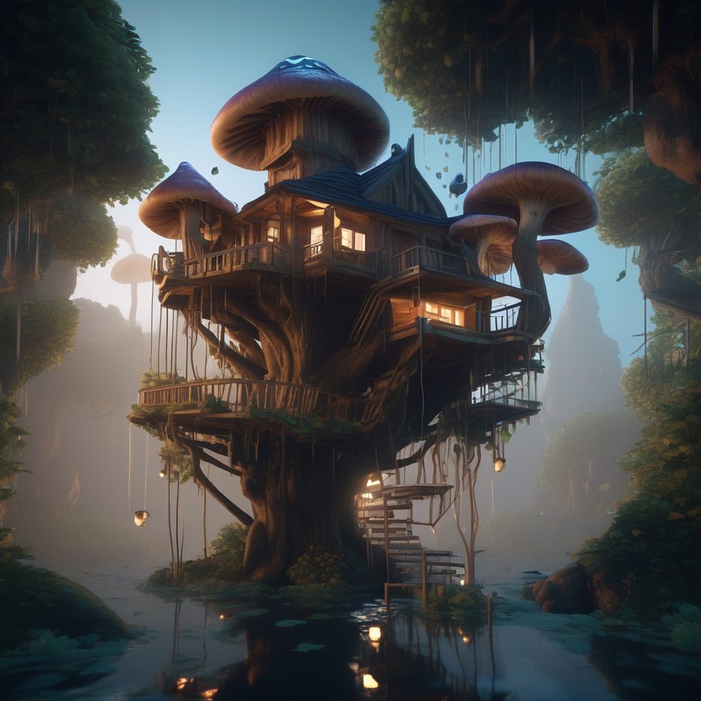
  
  <br>
  <em>Isometric view of a magical floating treehouse. Despite its 0.385B parameter budget, JuZhou 1.0 achieves competitive visual fidelity in lighting, texture, and compositional structure.</em>
</p>

<p align="center">
  
  
  
  
  
  <br>
  <em>Cyberpunk cat close-up portrait. JuZhou 1.0 consistently captures fine-grained textures and strong structural consistency across diverse prompts.</em>
</p>

### Distillation Efficacy: 28 Steps → 4 Steps

<p align="center">
  <em><b>4 steps (orig.)</b> &nbsp;&nbsp;&nbsp;&nbsp;&nbsp;&nbsp;&nbsp;&nbsp;&nbsp;&nbsp;&nbsp;&nbsp;&nbsp;&nbsp;&nbsp;&nbsp;&nbsp;&nbsp;&nbsp;&nbsp;&nbsp;&nbsp;&nbsp;&nbsp;&nbsp;&nbsp;&nbsp;&nbsp;  <b>8 steps</b> &nbsp;&nbsp;&nbsp;&nbsp;&nbsp;&nbsp;&nbsp;&nbsp;&nbsp;&nbsp;&nbsp;&nbsp;&nbsp;&nbsp;&nbsp;&nbsp;&nbsp;&nbsp;&nbsp;&nbsp;&nbsp;&nbsp;&nbsp;&nbsp;&nbsp;&nbsp;&nbsp;&nbsp; <b>16 steps</b> &nbsp;&nbsp;&nbsp;&nbsp;&nbsp;&nbsp;&nbsp;&nbsp;&nbsp;&nbsp;&nbsp;&nbsp;&nbsp;&nbsp;&nbsp;&nbsp;&nbsp;&nbsp;&nbsp;&nbsp;&nbsp;&nbsp;&nbsp;&nbsp;&nbsp;&nbsp;&nbsp;&nbsp;  <b>28 steps</b> &nbsp;&nbsp;&nbsp;&nbsp;&nbsp;&nbsp;&nbsp;&nbsp;&nbsp;&nbsp;&nbsp;&nbsp;&nbsp;&nbsp;&nbsp;&nbsp;&nbsp;&nbsp;&nbsp;&nbsp;&nbsp;&nbsp;&nbsp;&nbsp;&nbsp;&nbsp;&nbsp;&nbsp; <b>4 steps (distilled)</b></em>
   <br>
  
  
  
  
  
  <br>
  <em>cinematic portrait of a medieval knight wearing detailed silver armor, dramatic lighting, ultra realistic, 8k.</em>
</p>

<p align="center">
  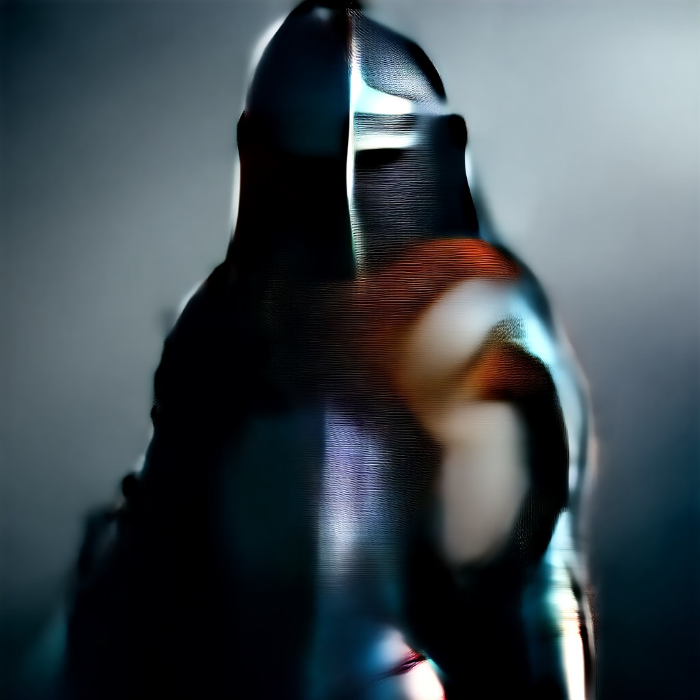
  
  
  
  
  <br>
  <em>Medieval knight in detailed silver armor. The non-distilled model suffers structural collapse at lower steps, while the distilled 4-step model maintains visual fidelity nearly identical to the 28-step baseline.</em>
</p>

<p align="center">
  
  
  
  
  
  <br>
  <em>Glass sculpture shaped like a swan. DMD2 distillation enables 7× step reduction with minimal perceptual degradation.</em>
</p>

### Classical Chinese Poetry-to-Image Generation

<p align="center">
 <em><b>Pop Art</b> &nbsp;&nbsp;&nbsp;&nbsp;&nbsp;&nbsp;&nbsp;&nbsp;&nbsp;&nbsp;&nbsp;&nbsp;&nbsp;&nbsp;&nbsp;&nbsp;&nbsp;&nbsp;&nbsp;&nbsp;&nbsp;&nbsp;&nbsp;&nbsp;&nbsp;&nbsp;&nbsp;&nbsp; <b>3D Animated Film</b> &nbsp;&nbsp;&nbsp;&nbsp;&nbsp;&nbsp;&nbsp;&nbsp; <b>Comic</b> &nbsp;&nbsp;&nbsp;&nbsp;&nbsp;&nbsp;&nbsp;&nbsp;&nbsp;&nbsp;&nbsp;&nbsp;&nbsp;&nbsp;&nbsp;&nbsp;&nbsp;&nbsp;&nbsp;&nbsp;&nbsp;&nbsp;&nbsp;&nbsp;&nbsp;&nbsp;&nbsp;&nbsp;&nbsp; <b>Chinese Classical Painting</b></em>
   <br>
  
  
  
  
  <br>
  <em>月到中秋例属苏 — Poetry-to-image generation under diverse artistic styles.</em>
</p>

<p align="center">
  
  
  
  
  <br>
  <em>曾经沧海难为水，从此桃源便是家 — Native Chinese understanding without external translation.</em>
</p>

<p align="center">
  
  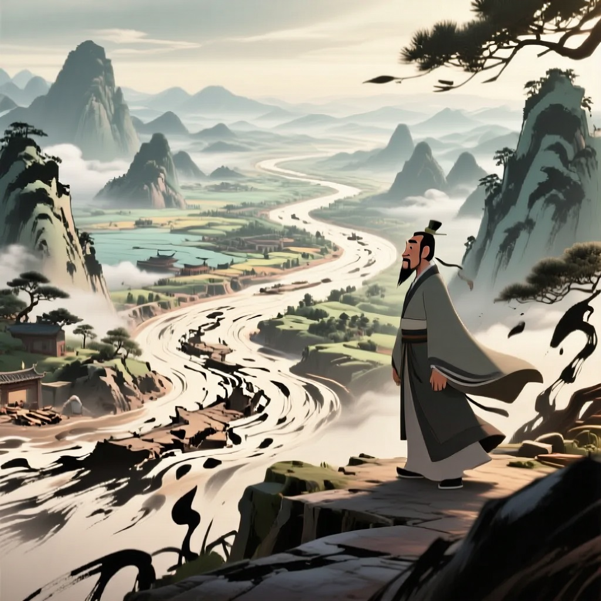
  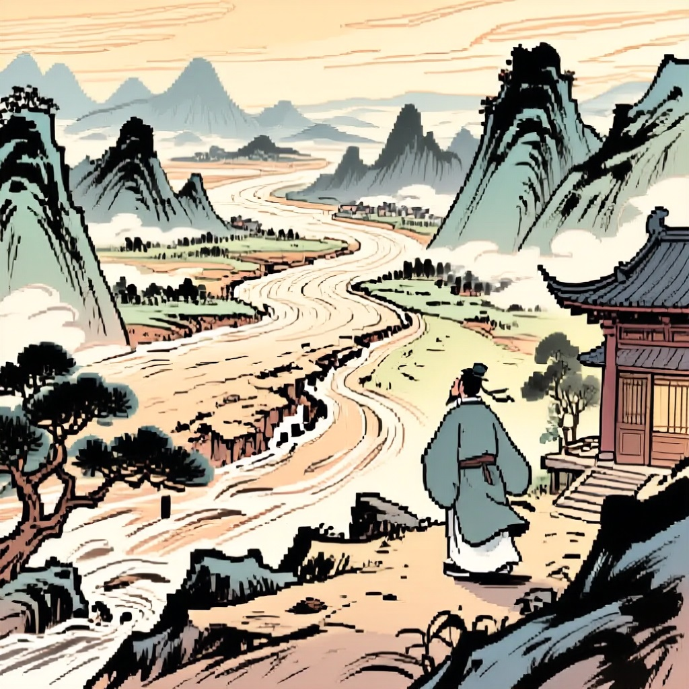
  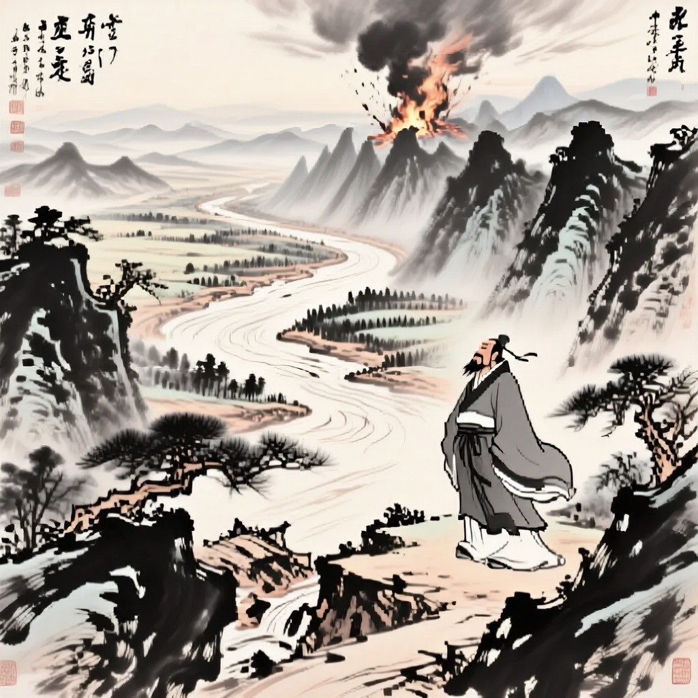
  <br>
  <em>几千年兴与亡，人间正道是沧桑 — Diverse visual interpretations of classical poetry across artistic styles.</em>
</p>

<p align="center">
  
  
  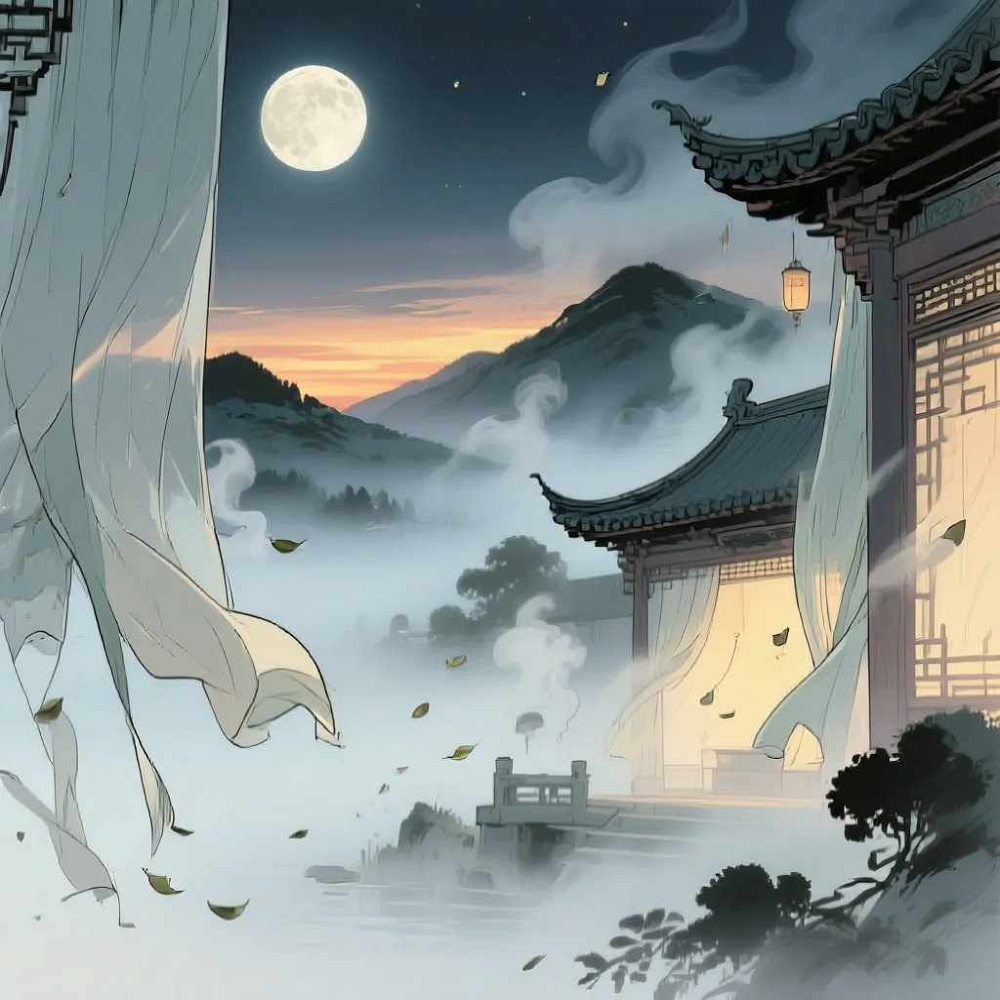
  
  <br>
  <em>梦凝白阑干，化为飞雾 — The model captures nuanced cultural contexts and abstract artistic conceptions without external translation modules.</em>
</p>

#### Poetry Benchmark (Quantitative)

| Model | Params | Prompt | Evaluator | Steps | CLIP Score↑ | FID↓ |
|:---|:---:|:---:|:---:|:---:|:---:|:---:|
| SDXL | 2.6B | CN | CN-CLIP | 50 | 18.74 | 135.65 |
| SDXL | 2.6B | EN | CLIP | 50 | 29.96 | 77.04 |
| SDXL-Lightning | 2.6B | CN | CN-CLIP | 4 | 18.54 | 164.62 |
| SDv2.1 | 1.3B | CN | CN-CLIP | 50 | 17.27 | 109.42 |
| LCM-4-Step | 0.86B | CN | CN-CLIP | 4 | 19.63 | 159.90 |
| SANA-0.6B | 0.6B | CN | CN-CLIP | 20 | 22.02 | 84.32 |
| **JuZhou 1.0** | **0.387B** | **CN** | **CN-CLIP** | **28** | **30.32** | **26.11** |
| **JuZhou 1.0 (distilled)** | **0.387B** | **CN** | **CN-CLIP** | **4** | **29.01** | **52.54** |

> 🏆 JuZhou 1.0 achieves the **best CN-CLIP score (30.32)** and **lowest FID (26.11)** on the poetry benchmark, significantly outperforming all baselines under direct Chinese prompting.

---

## 📱 Edge Device Deployment

<p align="center">
  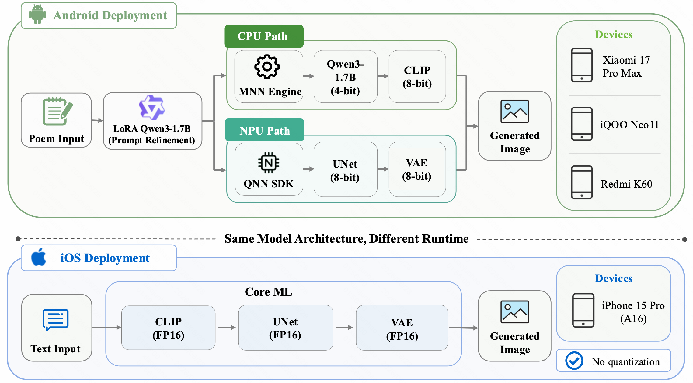
  <br>
  <em>Heterogeneous deployment architecture across Android and iOS platforms. On Android, the pipeline is partitioned between CPU (MNN engine for language model and text encoding) and NPU (QNN for U-Net and VAE decoding). On iOS, all diffusion modules run on Core ML in FP16 precision without additional quantization.</em>
</p>

### Android Deployment (Mojie 墨界 App)

The Android deployment adopts a **heterogeneous CPU–NPU runtime strategy**: prompt refinement and text encoding run on the CPU via MNN, while U-Net denoising and VAE decoding are offloaded to the Qualcomm NPU through the QNN SDK.

| Device | Mobile Platform | OS | Lat. w/o Ref. | Lat. w/ Ref. | Mem. w/o Ref. | Mem. w/ Ref. |
|:---|:---|:---:|:---:|:---:|:---:|:---:|
| **Xiaomi 17 Pro Max** | Snap. 8 Elite Gen 5 | Android 16 | **2.9 s** | **4.5 s** | 200 MB | 1.3 GB |
| iQOO Neo11 | Snap. 8 Elite | Android 16 | 3.5 s | 5.1 s | 200 MB | 1.3 GB |
| Redmi K60 | Snap. 8+ Gen 1 | Android 15 | 9.5 s | 12.7 s | 180 MB | 1.3 GB |

### On-Device U-Net Profiling (4-step, 1024×1024)

| Model | Denoiser+VAE | Platform (SoC) | Precision | Peak Mem | 4-step Total |
|:---|:---:|:---|:---:|:---:|:---:|
| SD 1.5 | ~0.91B | iPhone 15 (A17 Pro) | FP16 | — | — |
| SD 1.5 | ~0.91B | OnePlus 13 (SD 8 Elite) | INT8 | — | — |
| SDv2.1 | ~0.92B | iPhone 15 (A17 Pro) | FP16 | — | — |
| **JuZhou 1.0** | **~0.387B** | **iPhone 15 (A17 Pro)** | **FP16** | **~373 MB** | **~2.84 s** |
| **JuZhou 1.0** | **~0.387B** | **OnePlus 13 (SD 8 Elite)** | **INT8** | **~200 MB** | **~1.60 s** |

> ⚡ Mainstream SD 1.5 and SDv2.1 **fail to execute** on mobile due to excessive memory, while JuZhou 1.0 completes 4-step denoising in **~1.6 s** on Snapdragon 8 Elite.

### iOS Deployment

On iOS, Apple's **Core ML** framework provides a unified runtime for CLIP, U-Net, and VAE decoder. All three modules run in **FP16** precision without additional quantization. The total runtime memory footprint is **373 MB**, and 4-step diffusion latency is **4.25 s** on iPhone 15 Pro (A17 Pro).

### Cross-Platform Component Mapping

| Component | Android | iOS |
|:---|:---|:---|
| Prompt refinement | MNN CPU, 4-bit | Not used in validated setup |
| CLIP text encoder | MNN CPU, INT8 | Core ML, FP16 |
| U-Net denoiser | QNN NPU, INT8 | Core ML, FP16 |
| VAE decoder | QNN NPU, INT8 | Core ML, FP16 |
| Model delivery | Remote download to app sandbox | Core ML model packages |
| Orchestration | Native C++ Android app | Swift app with Core ML |

<p align="center">
  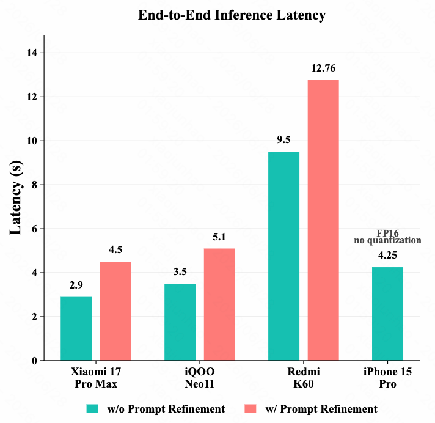
  <br>
  <em>Mobile inference latency comparison. Xiaomi 17 Pro Max completes the full pipeline in 4.5 s; iPhone 15 Pro runs the CLIP–U-Net–VAE branch in 4.25 s (FP16).</em>
</p>

---

## 🖥️ Training on Domestic AI Accelerators

The entire training and distillation pipeline was completed on **Sugon K100** AI accelerators — the first T2I foundation model trained entirely on China-developed computing infrastructure.

Adapting the training pipeline to the K100 AI platform required substantial software engineering: upgrading the runtime to support modern diffusion training dependencies, ensuring correct gradient backpropagation under the Rectified Flow formulation through targeted debugging and operator-level patching, and optimizing performance-critical modules (attention variants, separable convolutions) to better match K100 hardware characteristics. InfiniBand RDMA interconnect enables efficient cross-node gradient synchronization across the 224-device cluster.

| Specification | Value |
|:---|:---|
| Accelerator | Hygon DCU K100 |
| FP16/BF16 Performance | 196 TFLOPS |
| HBM3 | 64 GB |
| Memory Bandwidth | 896 GB/s |
| Host Interface | PCIe 5.0 x16 |
| Ecosystem | ROCm |
| **Nodes** | **56** |
| **Accelerators/Node** | **4** |
| **Total Accelerators** | **224** |
| **Interconnect** | **InfiniBand RDMA** |

---

## 🎨 Application: Mojie 墨界

Mojie is a mobile application that transforms classical Chinese poetry into high-quality images entirely on-device. The model is fine-tuned on our synthetic poem-image corpus to better capture poetic semantics, scene composition, and traditional Chinese artistic imagery.

| Feature | Description |
|:---|:---|
| 🔒 **Offline Generation** | Full poetry-to-image generation runs locally without network |
| 📚 **Poetry Library** | Tens of thousands of classical Chinese poems from pre-Qin to modern era |
| 🎨 **Multi-Style** | Pop Art, 3D Animation, Comic, Chinese Classical Painting, and more |
| 👥 **Community** | Share creations, browse, like, and comment on poetry-inspired artwork |

<p align="center">
  
  
  
  
  <br>
  <em>Mojie app screenshots: (a) Main interface, (b) Offline generation, (c) Poetry library, (d) Community sharing.</em>
</p>

📱 **Download:** [Android App (PGYER)](https://www.pgyer.com/mojiemobilellm-android)

---

## ⚠️ Code Availability

> **The source code and model weights of JuZhou 1.0 are currently undergoing internal company review and compliance clearance. We plan to release them publicly once the review process is complete. We appreciate your understanding and patience.**

In the meantime, you can:
- 📱 Try the **Mojie app** on Android to experience on-device generation
- 🌐 Visit the **[project page](https://hswai2026.github.io/JuZhouV1/)** for more details
- 📄 Read the **[technical report (LaTeX source)](https://github.com/Codecode-X/Juzhou/tree/main/JuZhou_Technical_Report)** for full methodology and results

---

## 👥 Team

### Core Contributors
Ce Chen, Congrui Wang, Yonglin Li, Zhenchen Wan, Mingyang Geng, Junhao Xiao, Zhengpeng Xing, Yaqing Hu, Yao Wu, Zhaoyang Qu

### Contributors
Long Lan, Xinwang Liu, Yingqi Peng, Shijia Li, Zufeng Zhang (Tsinghua University), Chen Ma (City University of Hong Kong), Jingjing Zhou (SUGON), Xingyu Wang (SUGON), Qilin Lu (SUGON), Bin Jiang (SUGON), Qilin Sun (The Chinese University of Hong Kong, Shenzhen)

### Project Leaders
Shanzhi Gu, Yaoguang Jin

### Acknowledgments
Tongliang Liu, Kede Ma, and Yifan Peng (The University of Hong Kong)

### Special Acknowledgments
JuZhou V1.0 was publicly unveiled at a launch event in Changsha, China, on May 21, 2025. The accompanying livestream attracted approximately 426,000 cumulative online views. As we prepare for the forthcoming release of JuZhou V2.0, this technical report provides a consolidated account of JuZhou V1.0, covering its design, training pipeline, deployment practice, and empirical evaluation.

We sincerely thank Sugon for its support in domestically developed AI computing infrastructure, including approximately 80 PFLOPS of K100 accelerator resources, which enabled the end-to-end training pipeline of this work. We also gratefully acknowledge support from the Hunan Provincial Key Research and Development Program under Grant No.~2025JK2146 and the Hunan Provincial College Student Entrepreneurship Investment Fund.

---

## 📌 Citation

```bibtex
@article{juzhou2026,
  title={JuZhou 1.0 Technical Report: The First Edge-Native Text-to-Image Foundation Model Trained Entirely on China-Developed AI Accelerators},
  author={JuZhou Team, HSW Group},
  year={2026}
}
```
